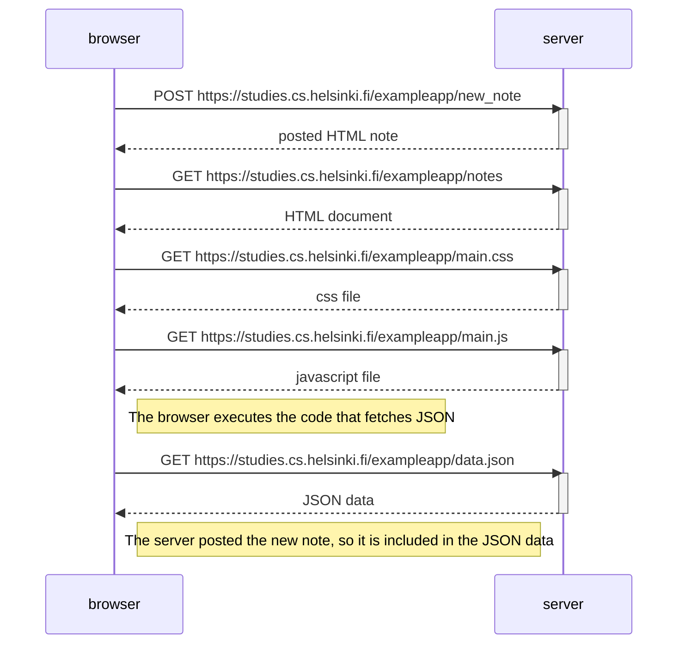

```mermaid
    sequenceDiagram
        participant browser
        participant server
        
       browser->>server: POST https://studies.cs.helsinki.fi/exampleapp/new_note
       activate server
       server-->>browser: posted HTML note
       deactivate server

       browser->>server: GET https://studies.cs.helsinki.fi/exampleapp/notes
       activate server
       server-->>browser: HTML document
       deactivate server 

       browser->>server: GET https://studies.cs.helsinki.fi/exampleapp/main.css
       activate server
       server-->>browser: css file 
       deactivate server

       browser->>server: GET https://studies.cs.helsinki.fi/exampleapp/main.js
       activate server
       server-->>browser: javascript file
       deactivate server

       Note right of browser: The browser executes the code that fetches JSON
    
       browser->>server: GET https://studies.cs.helsinki.fi/exampleapp/data.json
       activate server
       server-->>browser: JSON data
       deactivate server

       Note right of browser: The server posted the new note, so it is included in the JSON data

```