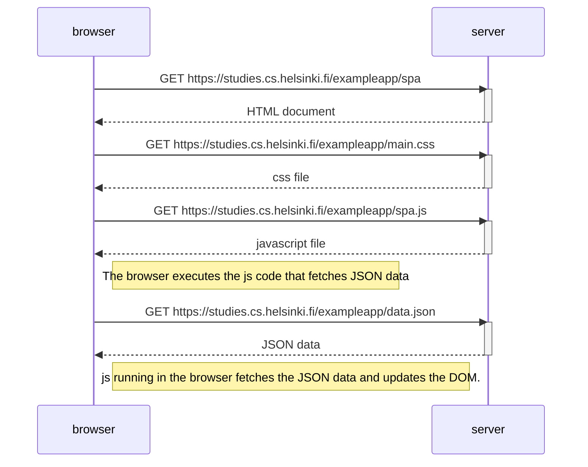

```mermaid
    sequenceDiagram
        participant browser
        participant server

       browser->>server: GET https://studies.cs.helsinki.fi/exampleapp/spa
       activate server
       server-->>browser: HTML document
       deactivate server

       browser->>server: GET https://studies.cs.helsinki.fi/exampleapp/main.css
       activate server
       server-->>browser: css file
       deactivate server

       browser->>server: GET https://studies.cs.helsinki.fi/exampleapp/spa.js
       activate server
       server-->>browser: javascript file
       deactivate server

       Note right of browser: The browser executes the js code that fetches JSON data

       browser->>server: GET https://studies.cs.helsinki.fi/exampleapp/data.json
       activate server
       server-->>browser: JSON data 
       deactivate server

       Note right of browser: js running in the browser fetches the JSON data and updates the DOM.
```